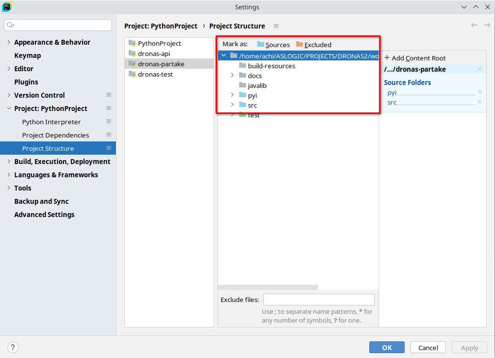

# Getting Started

First of all, follow the instructions of `GET_STARTED.md` from `dronas-api` to get the project attached into the workspace.

<!-- TOC -->
* [Getting Started](#getting-started)
  * [1. Source Folders](#1-source-folders)
  * [2. Install Java (for using Partake Detection)](#2-install-java-for-using-partake-detection)
  * [3. Setup your JVM](#3-setup-your-jvm)
<!-- TOC -->

## 1. Source Folders

First of all, make sure PyCharm knows which are the source folders of the project already.

- `src` is a _Source Root_
- `pyi` is a _Source Root_
- `test` is a _Test Source Root_

## 2. Install Java (for using Partake Detection)

Yes, Partake Detection algorithm is implemented in Java but executable from your python program. The only requirement to make work that feature is, having Java installed.

- If you are on *Linux*:

Install it with your package manager, in debian is `sudo apt install openjdk-21`

- If you are on any other platform, the recommended one is Temurin from Eclipse:

[https://adoptium.net/es/temurin/releases/?os=windows&arch=x64&version=21]()

Select your platform the JDK (preferred for people that code like you) and then on the installer. On Windows use the (.msi) and on Mac, the (.dmg).

## 3. Setup your JVM

As it is done in `dronas-api`, it is required tocopy the file with name `javainit.template.py` removing "template" from the name. The file will become named `javainit.py`.
Then, from this new file, **only if java doesn't work directly when executing a detection test**, uncomment the line to specify the path of the _JVM_ in your machine.
